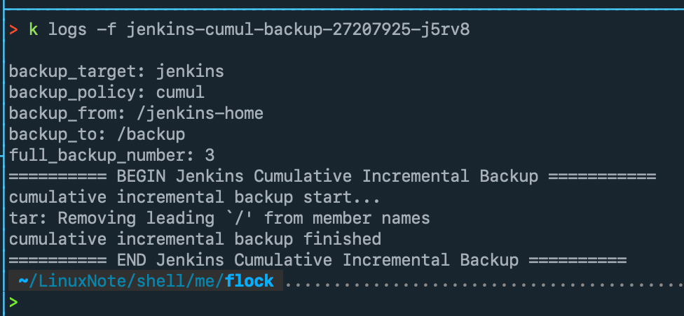

## 介绍

### 备份类型支持

- 全量备份 full backup
- 累计增量备份 cumulative incremental backup
- 差异增量备份 differential incremental backup

### [Cumulative Incremential Backup] vs [Differential Incremental Backup]

```
Cumulative Incremental:
		This will backup all changes this the last Full backup.
Differential Incremental:
		This will backup all changes since last backup - Full or Incremental.
```

具体以后介绍


### 部分截图




