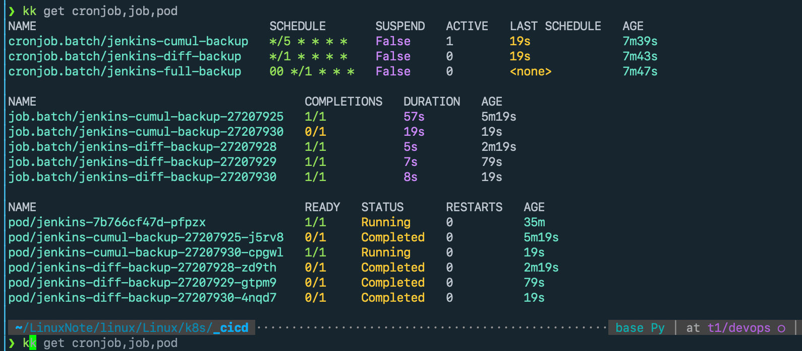
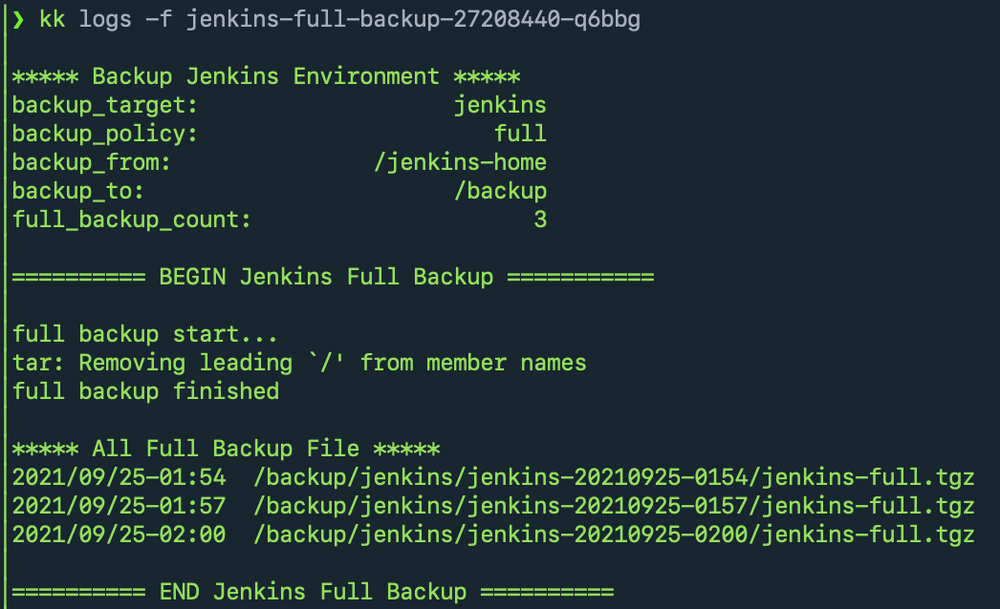
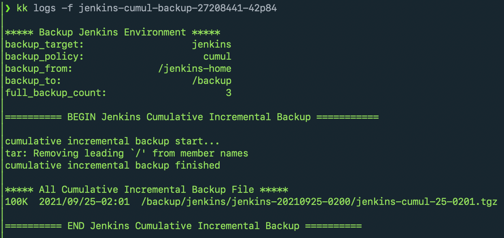
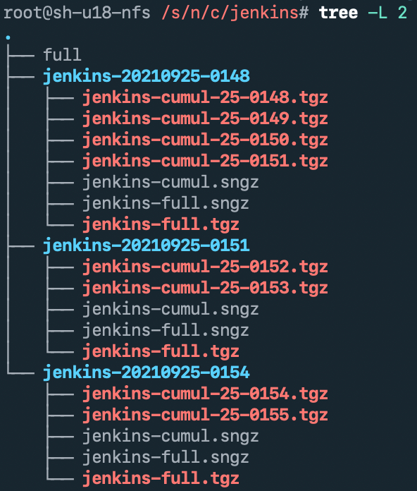

## 介绍

### 备份类型支持

- 全量备份 full backup
- 累计增量备份 cumulative incremental backup
- 差异增量备份 differential incremental backup

### [Cumulative Incremential Backup] vs [Differential Incremental Backup]

```
Cumulative Incremental:   This will backup all changes this the last Full backup.
Differential Incremental: This will backup all changes since last backup - Full or Incremental.

总结来说就是：
  - Cumulative Incremental:  更占存储空间，但恢复备份的速度更快
  - Differential Incremental: 占用存储空间相对少，当然恢复备份的速度想对更慢
```

### 具体如何恢复，稍等下再写

### Jenkins 备份和恢复测试没问题

### 后续还会增加更多的备份对象、优化通用备份脚本、给通用备份脚本添新功能

- gitlab、jenkins
- postgresql、gitlab
- cassandra、redis
- 等等

### 以后直接做成 helm 包

### 截图








